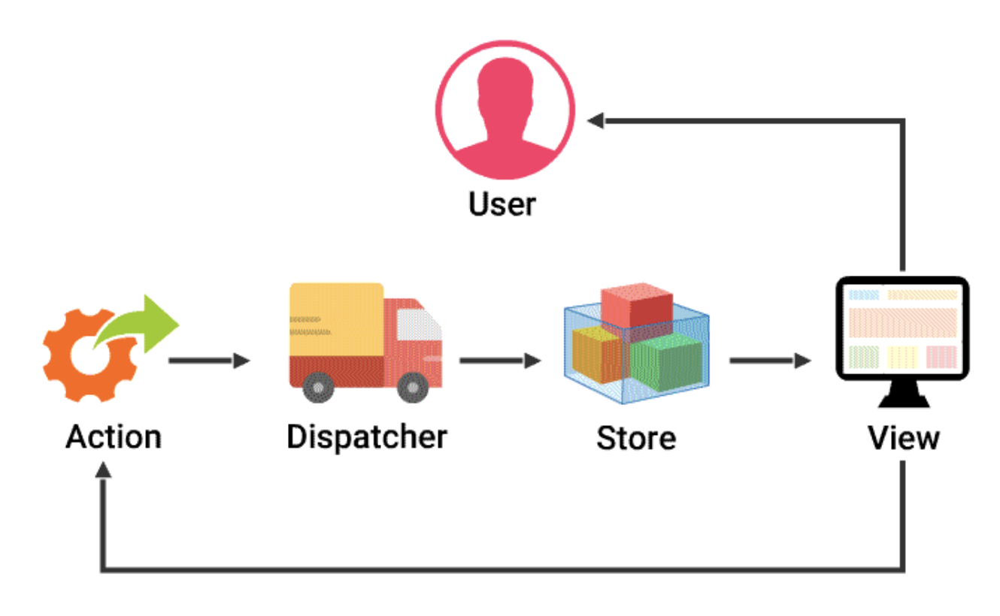

# Redux

Redux is a predictable state container for JavaScript apps.
Using Redux, developers can incorporate simplified and centralized approach to state management within the client application. Redux makes it easier to understand and debug applications.

Useful References: https://react-redux.js.org/

Useful Resources:

- Redux Form: https://redux-form.com/8.2.2/docs/gettingstarted.md/

---------------Notes---------------:
- Routing

- Async
> Callbacks - Good
> Promises  - Better
> Generators- Awesome

> Redux-thunk and Redux-saga are middleware (higher order functions) that are used to make asynchronous API calls in Redux.
```
export const sinFunction = () => (dispatch, getState) => {
 dispatch({
  type: GET_DETAILS
 })
 setTimeout(() => {
  dispatch({
   type: CANCEL_FETCH
 })
 }, 2000)
}
```


- Changes are initiated with Action objects that describe the change.
- A Dispatcher sends the action to appropriate store.
- The Store is responsible for maintaining the application state.
- When the store updates the data, the View and the screen changes, reflecting the data back to the user.
- As a Flux application grows, it may include multiple stores and views, but the data flow remains unidirectional.


https://redux.js.org/tutorials/fundamentals/part-1-overview