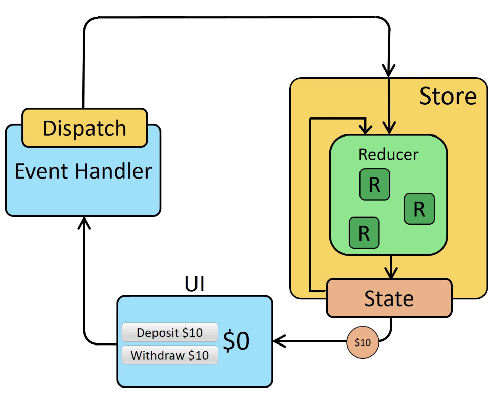
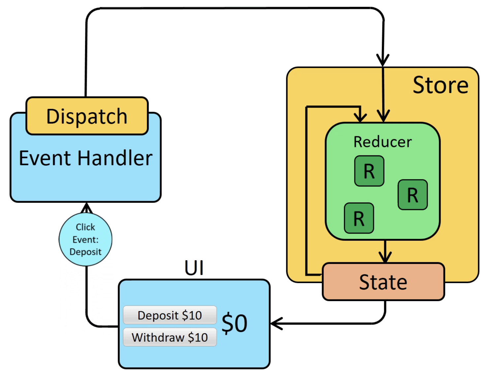
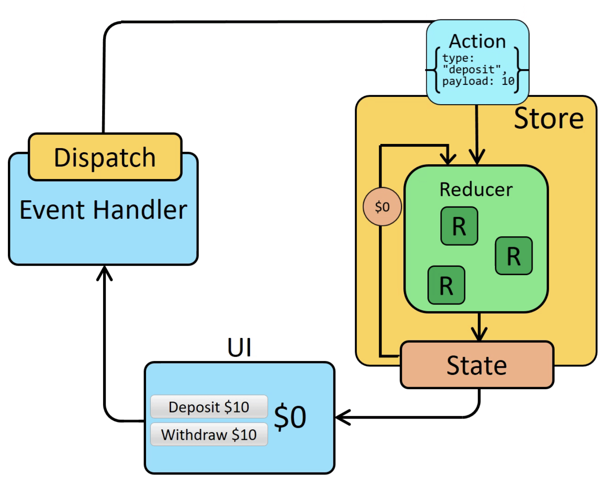

# Redux

Redux is a predictable state container for JavaScript apps.
Using Redux, developers can incorporate simplified and centralized approach to state management within the client application. Redux makes it easier to understand and debug applications.

Useful References: https://react-redux.js.org/

Useful Resources:

- Redux Form: https://redux-form.com/8.2.2/docs/gettingstarted.md/

---------------Notes---------------:
- Routing

- Async
> Callbacks - Good
> Promises  - Better
> Generators- Awesome

> Redux-thunk and Redux-saga are middleware (higher order functions) that are used to make asynchronous API calls in Redux.
```
export const sinFunction = () => (dispatch, getState) => {
 dispatch({
  type: GET_DETAILS
 })
 setTimeout(() => {
  dispatch({
   type: CANCEL_FETCH
 })
 }, 2000)
}
```


- Changes are initiated with Action objects that describe the change.
- A Dispatcher sends the action to appropriate store.
- The Store is responsible for maintaining the application state.
- When the store updates the data, the View and the screen changes, reflecting the data back to the user.
- As a Flux application grows, it may include multiple stores and views, but the data flow remains unidirectional.

### Redux - Store
```
- To update the Store, must be done via an 'action' object.
- Dispatch the 'action' to let the store know.
- When a dispatch occurs, the store runs the root 'reducer' function, and lets it calculate the new state based on the old state and the action.
- Finally, the store notifies 'subscribers' that the state has been updated so the UI can be updated with the new data.
```

- State, Actions, and Reducers

 1.) Start by defining an initial state value to describe the application:
 ```
 const initialState = {
  value: 0
}
 ```
 2.) Then, define a reducer function. The reducer receives two arguments, the current state and an action object describing what happened. When the Redux app starts up, we don't have any state yet, so we provide the initialState as the default value for this reducer:
 ```
 function counterReducer(state = initialState, action) {
  switch (action.type) {
    case 'counter/incremented':
      return { ...state, value: state.value + 1 }
    case 'counter/decremented':
      return { ...state, value: state.value - 1 }
    default:
      // If the reducer doesn't care about this action type,
      // return the existing state unchanged
      return state
  }
}
 ```
 3.) Finally, we need to respond to user input by creating action objects that describe what happened, and dispatching them to the store.
 ```
 store.dispatch({ type: 'counter/incremented' })
 ```

### Data Flow

> actions are dispatched in response to a user interaction like a click
> the store runs the reducer function to calculate a new state
> the UI reads the new state to display the new values

  


### State Management
```
function Counter() {
  // State: a counter value
  const [counter, setCounter] = useState(0)

  // Action: code that causes an update to the state when something happens
  const increment = () => {
    setCounter(prevCounter => prevCounter + 1)
  }

  // View: the UI definition
  return (
    <div>
      Value: {counter} <button onClick={increment}>Increment</button>
    </div>
  )
}
```
> The state, the source of truth that drives the app;
> The view, a declarative description of the UI based on the current state
> The actions, the events that occur in the app based on user input, and trigger updates in the state

```
const obj = {
  a: {
    // To safely update obj.a.c, we have to copy each piece
    c: 3
  },
  b: 2
}

const obj2 = {
  // copy obj
  ...obj,
  // overwrite a
  a: {
    // copy obj.a
    ...obj.a,
    // overwrite c
    c: 42
  }
}

const arr = ['a', 'b']
// Create a new copy of arr, with "c" appended to the end
const arr2 = arr.concat('c')

// or, we can make a copy of the original array:
const arr3 = arr.slice()
// and mutate the copy:
arr3.push('c')
```


